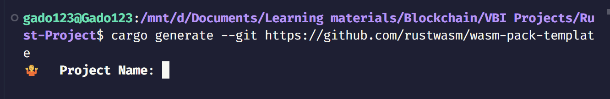
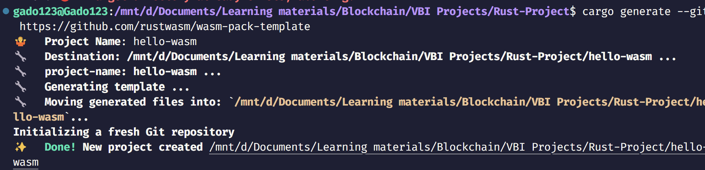
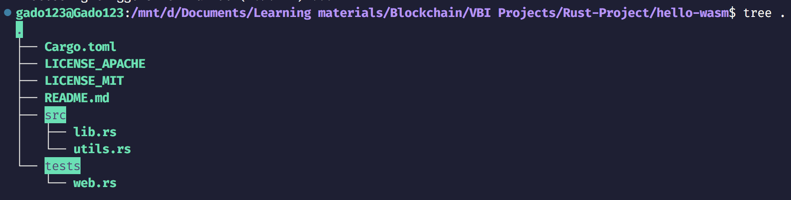
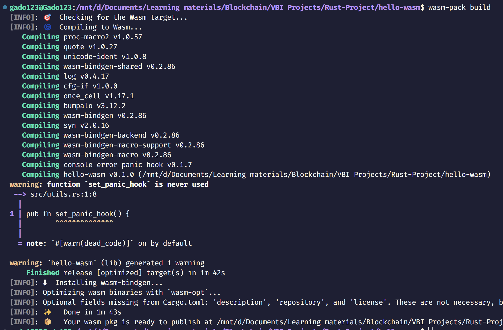
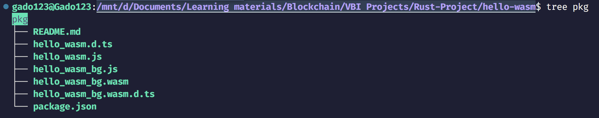
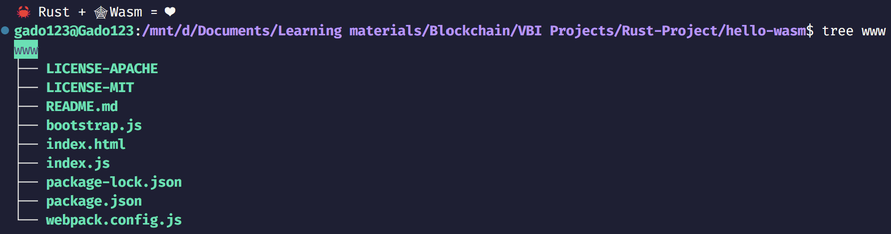
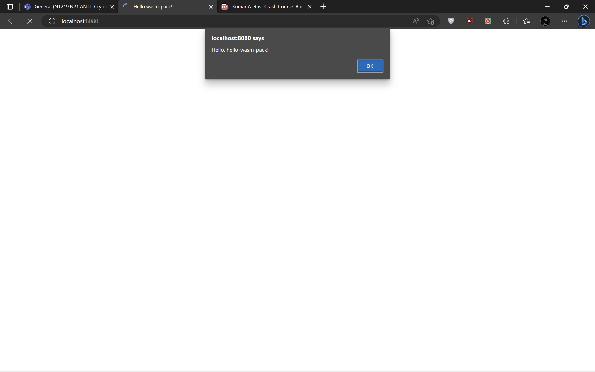

# Introduction

Xin chào mọi người! Hôm nay mình sẽ tiếp tục thực hiện project tiếp theo. Chúng ta sẽ phát triển một ứng dụng web để xác thực tên người dùng (username) và mật khẩu (password). Nếu username và password khớp, chương trình sẽ hiển thị thông báo đăng nhập thành công. Ngược lại, chương trình sẽ hiển thị thông báo đăng nhập thất bại. Ứng dụng có thể chạy trên trình duyệt và sẽ có UI cơ bản, như trường username và password, và các button như login, reset và logout.

# Set up environment
## wasm-pack

`wasm-pack` là một công cụ dùng để build, test và publish code WebAssembly được tạo từ Rust. Cài đặt bằng lệnh sau:

```bash
cargo install wasm-pack
```

## cargo-generate

Bạn cũng có thể cài đặt công cụ `cargo-generate`, công cụ này giúp bạn nhanh chóng bắt đầu với một project Rust mới bằng cách sử dụng một Git repository như một template. Cài đặt bằng lệnh sau:

```bash
cargo install cargo-generate
```

## npm

`npm` là một package manager của Javascript. Công cụ này được sử dụng để cài đặt, chạy JavaScript bundler và development server. Ta sẽ publish file `.wasm` đã biên dịch lên `npm` registry. Cài đặt bằng lệnh sau:

```bash
sudo apt install npm
```

# Creating a hello-wasm project

Ok! Ta đã thực hiện quá trình xong setup các công cụ cần thiết. Tiếp theo, ta sẽ tạo project `hello-wasm` như sau:

1. Ta sẽ dùng `cargo generate` để tạo project Rust với template có sẵn:

    ```bash
    cargo generate --git https://github.com/rustwasm/wasm-pack-template
    ```

    

2. Nhập tên project là `hello-wasm`, các file cần thiết của project sẽ được tạo theo template, quá trình tạo sẽ diễn ra như hình bên dưới:

    

3. Project `hello-wasm` sẽ được cấu trúc như sau:

    

4. File `Cargo.toml` chỉ định các dependencies và metadata cho `cargo`. Nó chứa một dependency `wasm-bindgen` như sau:

    ```
    [dependencies]
    wasm-bindgen = "0.2.63"
    ```

5. File `src/lib.rs` sử dụng `wasm-bindgen` để tương tác với JavaScript. Nó import hàm `window.alert` trong JavaScript và export hàm `greet` trong Rust, hàm này sẽ xuất một thông báo như sau:

    ```rs
    #[wasm_bindgen]
    extern {
        fn alert(s: &str);
    }
    
    #[wasm_bindgen]
    pub fn greet() {
        alert("Hello, hello-wasm!");
    }
    ```
6. Tiếp theo, chúng ta build project `hello-wasm` bằng cách sử dụng lệnh `wasm-pack build`:

    

7. Sau khi build xong, các tài nguyên của nó được tạo ra trong thư mục `pkg`:

    

    File `hello-wasm/pkg/hello_wasm_bg.wasm` là tệp nhị phân WebAssembly được tạo ra bởi Rust compiler từ source code ban đầu. Nó chứa các phiên bản `wasm` của tất cả các function và dữ liệu từ Rust.

8. File `hello-wasm/pkg/hello_wasm_bg.js` được tạo ra bởi `wasm-bindgen`, nó cho phép nhập các DOM và JavaScript function vào Rust và nối các API đến các WebAssembly function cho JavaScript. Nó chứa hàm `greet`, hàm này được export từ hàm `greet` trong WebAssembly module như sau:

    ```js
    import * as wasm from ‘./hello_wasm_bg.wasm’;
    // ...
    export function greet() {
        wasm.greet();
    }

    ```

9. File `hello-wasm/pkg/package.json` chứa metadata về JavaScript và WebAssembly package được tạo:

    ```json
    {
        "name": "hello-wasm",
        "collaborators": [
        "Abhishek Kumar <your.email@example.com>"
        ],
        "version": "0.1.0",
        "files": [
        "hello_wasm_bg.wasm",
        "hello_wasm.js",
        "hello_wasm_bg.js",
        "hello_wasm.d.ts"
        ],
        "module": "hello_wasm.js",
        "types": "hello_wasm.d.ts",
        "sideEffects": false
    }
    ```
10. Để sử dụng `hello-wasm` package trên web, ta chạy lệnh sau trong thư mục `hello-wasm`:

    ```bash
    npm init wasm-app www
    ```

11. Lệnh trên sẽ tạo thư mục `www` chứa các file như sau:

    

12. File `www/index.html` là file HTML gốc cho trang web, nó sẽ load file `bootstrap.js`:

    ```html
    <!DOCTYPE html>
    <html>
        <head>
            <meta charset="utf-8">
            <title>Hello wasm-pack!</title>
        </head>
        <body>
            <noscript>This page contains webassembly and javascript content, please enable javascript in your browser.
            </noscript>
            <script src="./bootstrap.js"></script>
        </body>
    </html>
    ```

13. File `www/package.json` là tệp cấu hình chính (configuration file). Thay vì sử dụng `hello-wasm-pack` package từ `npm`, chúng ta sẽ sử dụng local `hello-wasm` package. Ta sẽ thêm đoạn code sau dưới `devDependencies` trong `www/package.json`:

    ```json
    "devDependencies": {
        "hello-wasm": "file:../pkg",
    //...
    }
    ```

14. File `www/index.js` là entry point cho JavaScript trên trang web. Nó sẽ import `hello-wasm-pack` npm package và gọi hàm `greet` của `hello-wasm-pack`:

    ```js
    import * as wasm from "hello-wasm-pack";
    wasm.greet();
    ```

15. Ta sửa file `www/index.js` để import `hello-wasm` thay vì `hello-wasm-package`:

    ```js
    import * as wasm from "hello-wasm";
    wasm.greet();
    ```

16. Để cài đặt local server và các dependencies, chúng ta chạy lệnh sau từ thư mục con `hello-wasm/www`:

    ```bash
    npm install
    ```

17. Ok!, bây giờ trang web của chúng ta đã sẵn sàng để chạy. Chạy lệnh sau từ thư mục `hello-wasm/www` để run local server:

    ```bash
    npm run start
    ```

18. Nhập đường dẫn `http://localhost:8080/` vào web browser, trang web sẽ show một alert message như sau:

    