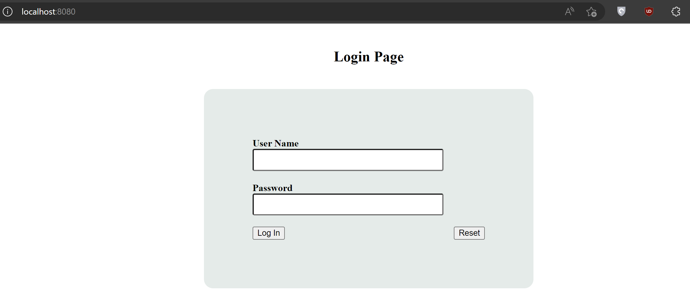

Chào mọi người, ở phần trước chúng ta đã cùng nhau setup các công cụ cần thiết để biên dịch Rust code sang WebAssembly để tích hợp vào Javascript và chạy thử project trên Web Browser. Ở phần này chúng ta sẽ đến với phần chính của project đó là thiết kế giao diện login và xử lí logic code.

# Creating wasm-login project

Các bước thực hiện như sau:

1. Dùng cùng template với `hello-wasm` project: 

    ```bash
    cargo generate --git https://github.com/rustwasm/wasm-pack-template
    ```
2. Lưu tên project là `wasm-login`:

    ```bash
    cd wasm-login
    wasm-pack build
    npm init wasm-app www
    cd www
    ```
3. Thêm `wasm-login` package vào `devDependencies` trong `www/package.json`:

    ```json
    "devDependencies": {
        "wasm-login": "file:../pkg",
    //...
    }
    ```

4. Cập nhật file `www/index.js`:

    ```js
    import * as wasm from "wasm-login";
    ```

5. Cài đặt các dependencies:

    ```bash
    npm install
    ```
6. Start local server:

    ```bash
    npm run start
    ```
7. Nhập đường dẫn `http://localhost:8080/` vào web browser:


Tiếp theo, ta thiết kết UI trong `www/index.html`. UI sẽ gồm một form chứa hai trường `username` và `password` và hai button `Login` và `Reset`:

```html
<!DOCTYPE html>
<html>
    <head>
        <meta charset="utf-8">
        <title>Login App</title>
    </head>
    <body>
        <h2 id="h2_login">Login Page</h2>
        <div class="div_login" id="div_login">
            <form id="frm_login" method="get" action="login.php">
                <label id="lbl_uname"><b>User Name</b></label>
                <input type="text" name="Uname" id="Uname">
                <br><br>
                <label id="lbl_pwd"><b>Password</b></label>
                <input type="Password" name="Pass" id="Pass">
                <br><br>
                <input type="button" name="login" id="btn_login"
                value="Log In">
                <input type="button" name="reset" id="btn_reset"
                value="Reset">
                <br>
            </form>
        </div>
        <script src="./bootstrap.js"></script>
    </body>
</html>
```

8. Reload lại trang web, ta sẽ thấy UI được cập nhật như dưới đây:

    

    Ta sẽ xoá lời gọi hàm `wasm.greet()` trong `www/index.js` để web page không alert message mỗi lần reload lại page. 

9. Trang web nhìn hơi xấu, nên mình sẽ thêm tí màu mè cho nó nhìn đẹp hơn xíu. Tạo file `style.css` trong thư mục `www` như sau:

    ```css
    .div_login{
        width: 382px;
        overflow: hidden;
        margin: auto;
        margin: 20 0 0 450px;
        padding: 80px;
        background: #e4ebe9;
        border-radius: 15px ;
    }

    h2{
        text-align: center;
        padding: 20px;
    }

    #Uname{
        width: 300px;
        height: 30px;
        border-radius: 3px;
        padding-left: 8px;
    }

    #Pass{
        width: 300px;
        height: 30px;
        border-radius: 3px;
        padding-left: 8px;
    }

    #btn_login{
        float: left;
    }

    #btn_reset{
        float: right;
    }
    ```

10. Nhúng file `style.css` vào `index.html`, sau đó reload lại trang web, UI bây giờ nhìn đẹp hơn ban đầu rồi :v

    

11. Tiếp theo, ta sẽ thêm click event cho 2 button `Login` và `Reset` trong file `index.js`, gồm 2 function lần lượt là `click_login` và `click_reset` tương ứng với từng button:

    ```js
    document.getElementById("btn_login").addEventListener("click", ev => click_login());

    document.getElementById("btn_reset").addEventListener("click", ev => click_reset());    
    ```

    Trong function `click_login`, ta sẽ lấy username và password nhập bởi người dùng và gọi hàm `login` trong `wasm-login/src/lib.rs` để tiến hành xác thực các giá trị trên. Dưới đây là ví dụ cho hàm `login` dùng để xác thực username và password của user (trong thực tế không ai code naive như vậy :v):

    ```rs
    #[wasm_bindgen]
    pub fn login(uname: &str, pwd: &str) -> bool {
        if uname == "gado123" && pwd == "gado321" {
            true
        }
        else {
            false
        }
    }
    ```

    Với function `click_reset`, chức năng của nó đơn giản chỉ là xoá các giá trị trong các ô username và password mà người dùng đã nhập.

    File `index.js` sẽ như sau:

    ```js
    import * as wasm from "wasm-login";

    document.getElementById("btn_login").addEventListener("click", ev => click_login());

    document.getElementById("btn_reset").addEventListener("click", ev => click_reset());

    function click_login() {
        let isLogin = true;
        if (document.getElementById("btn_login").value == "Log In") { // Log In
            let uname = document.getElementById("Uname").value;
            let pwd = document.getElementById("Pass").value;
            console.log("Username = ", uname);
            if(wasm.login(uname, pwd)){
                document.getElementById("lbl_uname").style.visibility =
                "hidden";
                document.getElementById("lbl_pwd").style.visibility =
                "hidden";
                document.getElementById("Uname").style.visibility =
                "hidden";
                document.getElementById("Pass").style.visibility =
                "hidden";
                document.getElementById("btn_reset").style.visibility =
                "hidden";
                document.getElementById("btn_login").value = "Log Out";
                document.getElementById("h2_login").innerHTML = "Hello,".concat(uname);
                } 
            else {
                wasm.login_failure();
            }
        }
        else { // Log out
            document.getElementById("lbl_uname").style.visibility =
            "visible";
            document.getElementById("lbl_pwd").style.visibility =
            "visible";
            document.getElementById("Uname").style.visibility =
            "visible";
            document.getElementById("Pass").style.visibility =
            "visible";
            document.getElementById("btn_login").value = "Log In";
            document.getElementById("btn_reset").style.visibility =
            "visible";
            document.getElementById("Pass").value = "";
            document.getElementById("h2_login").innerHTML = "Login Page";
        }
    }

    function click_reset() {
        document.getElementById("Uname").value = "";
        document.getElementById("Pass").value = "";
    }   
    ```

    Nếu người dùng nhập sai username và password, `index.js` sẽ gọi tới hàm `login_failure()` trong `wasm-login/src/lib.rs` để thông báo đăng nhập không thành công:

    ```rs
    #[wasm_bindgen]
    pub fn login_failure() {
        alert("Invalid credentials !!! Try again...");
    }
    ```
12. Vì ta thực hiện thay đổi trên file `lib.rs` nên cần phải thực hiện build lại project (quay trở lại folder `wasm-login` trước khi build):

    ```bash
    wasm-pack build
    ```
13. Cài đặt lại các dependencies trong thư mục `www`:

    ```bash
    npm install
    ```

14. Start local server:

    ```bash
    npm run start
    ```
15. Cùng test lại trang web của chúng ta nào!

    Khi nhập đúng username và password (`gado123` - `gado321`), trang web sẽ hiện message `Hello,gado123`:

    

    Khi nhập sai username và passwword, trang web sẽ arlet message như sau:

    


OK! All done! Vậy là chúng ta đã hoàn thành project này. Mọi người có thể phát triển nó thành một ứng dụng hoàn chỉnh bằng cách thêm database để lưu trữ thông tin của user gồm username và password và fetch data vào để xử lí.


