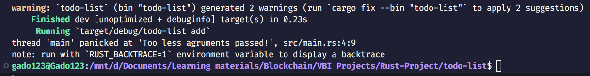
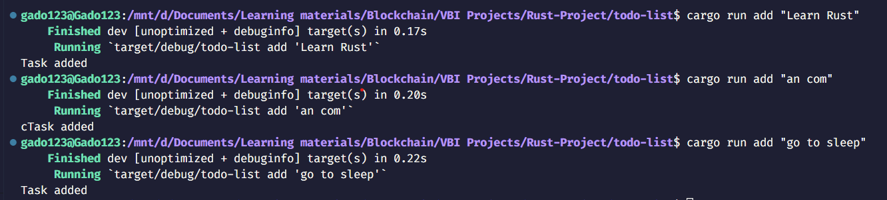
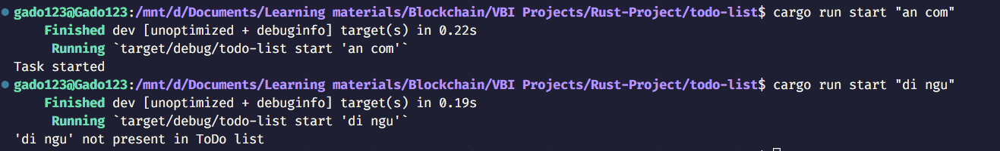

# Introduction
Xin chào mọi người, mình là Ga Đô. Sau một thời gian học về Rust thì hôm nay mình sẽ bắt tay vào làm project đầu tiên, đây là project thiết kế một CLI Application có tên là To-do List.

# Goals

Áp dụng được các concept cơ bản trong Rust để xây dựng được một Command-line Interface Application.

# To-do list

To-do list được dùng để lưu trữ danh sách các công việc mà chúng ta muốn thực hiện và có thể theo dõi quá trình thực hiện các công việc này. Giả sử chúng ta muốn triển khai một danh sách công việc cần làm, ta cần lưu các công việc khác nhau, với mỗi công việc sẽ ở trong một trong ba trạng thái sau: Cần làm (To do), Đang tiến hành (In progress), và Hoàn thành (Done). Ứng dụng của chúng ta sẽ nhận trạng thái (state) và tên của công việc dưới dạng command-line agrument.

# Implementing To-do list
## Creating the project
Đầu tiên, ta sẽ tạo một project có tên là todo-list bằng lệnh sau:

```bash
cargo new todo-list
```

## Capturing command-line arguments

Ta sẽ lấy các command-line agrument từ command-line như sau:

```rs
fn main() {
    let agrs: Vec<String> = std::env::args().collect();
    if agrs.len() < 3 {
        panic!("Too less agruments passed!");
    }
    let action = agrs[1].clone();
    let task = agrs[2].clone();
}
```

Trong đoạn code trên, ta mong đợi user nhập hai command-line agrument cùng với lệnh `cargo run`. Đối số đầu tiên biểu thị một hành động (action), và đối số thứ hai biểu thị một công việc (task) cần được thêm vào danh sách công việc cần làm (To-do list). Chúng ta sử dụng `std::env::args()` để lấy các command-line agrument. Hàm `std::env::args()` trả về một `Args` iterator, ta sẽ nhóm thành một vector để lấy danh sách các đối số. Đối số đầu tiên là chính chương trình. Chúng ta quan tâm đến đối số thứ hai và thứ ba, biểu thị một hành động (action) và một công việc (task) tương ứng. Các giá trị có thể của hành động sẽ là `add`, `start`, hoặc `done`. Giá trị của `add` biểu thị một công việc mới (new task) cần được thêm vào to-do list. Giá trị của `start` dùng để cập nhật trạng thái của công việc đã có trong to-do list thành trạng thái đang thực hiện (`In Progress`). Giá trị của `done` cho phép chương trình của chúng ta cập nhật trạng thái của một công việc trong to-do list thành đã hoàn thành (`Done`). Chương trình của chúng ta sẽ không xóa công việc đã hoàn thành vì việc theo dõi chúng có thể sẽ hữu ích. Nếu user không truyền tất cả các đối số, chương trình sẽ raise `panic` với thông báo `Too less arguments passed!` như dưới đây:



## Defining the To-do structure

Ta sẽ định nghĩa một struct tên là `Todo` chứa một `hashmap` lưu trữ các task và state tương ứng của chúng như sau:

## Implementing methods of Todo struct

Các bước thực hiện như sau:

1. Định nghĩa một số method tương ứng với struct `Todo`. Cụ thể, ta sẽ định nghĩa các method `new()`, `insert()`, `save()`, `start()` và `done()` cho struct của chúng ta. Trong method `new()`, ta cần mở một file có tên là `todo.db` để lưu các task và state của chúng trong các lần chạy khác nhau của ứng dụng. Với lần chạy đầu tiên, một tệp mới sẽ được tạo ra. Trong các lần chạy tiếp theo, nội dung của tệp bao gồm các task và state của chúng được đọc và thêm vào `hashmap` trong struct `Todo` như sau:

    ```rs
    impl Todo {
        fn new() -> Result<Todo, std::io::Error> {
            let mut f = std::fs::OpenOptions::new()
                .write(true)
                .create(true)
                .read(true)
                .open("todo.db")?;
            let mut content = String::new();
            f.read_to_string(&mut content)?;
            let map: HashMap<String, String> = content
                .lines()
                .map(|line| line.split(" : ").collect::<Vec<&str>>
                ())
                .map(|v| (v[0], v[1]))
                .map(|(k, v)| (String::from(k), String::from(v)))
                .collect();
            Ok(Todo {map})
        }
    }
    ```

2. Tiếp theo, ta sẽ định nghĩa một method có tên là `insert()` để thêm một task mới vào danh sách. Trong method `insert`, chúng ta chỉ cần thêm tên của task làm khóa và state `To Do` làm giá trị như sau:

    ```rs
    fn insert(&mut self, key: String) {
        self.map.insert(key, String::from("To Do"));
    }
    ```
3. Ta tiếp tục định nghĩa method `start()`, method này nhận tên của task làm đối số, tìm task trong To-do list và cập nhật state của nó thành `In Progress` như sau:

    ```rs
    fn start(&mut self, key: &String) -> Option<()> {
        match self.map.get_mut(key) {
        Some(v) => Some(*v = String::from("In Progress")),
        None => None,
        }
    }
    ```

4. Tương tự, chúng ta định nghĩa method `done()`, hàm này cũng nhận tên của một task làm đối số và cập nhật state của nó thành `Done` trong To-do list:

    ```rs
    fn done(&mut self, key: &String) -> Option<()> {
        match self.map.get_mut(key) {
        Some(v) => Some(*v = String::from("Done")),
        None => None,
        }
    }
    ```

5. Cuối cùng, method `save()` dùng để ghi nội dung của struct `Todo` vào database `todo.db` để có thể sử dụng trong các lần chạy tiếp theo của ứng dụng:

    ```rs
    fn save(self) -> Result<(), std::io::Error> {
        let mut content = String::new();
        for (k, v) in self.map {
        let record = format!("{} : {}\n", k, v);
        content.push_str(&record)
        }
        std::fs::write("todo.db", content)
    }
    ```

6. Ta sẽ cập nhật hàm `main()` để xử lý các trường hợp tương ứng với các action khác nhau, cụ thể là `add`, `start` và `done`. Với `add`, thêm task vào danh sách và cập nhật vào database. Với `start`, tìm và cập nhật trạng thái của task đã cho thành `In Progress` và cập nhật vào database. Tương tự với `done`, cập nhật trạng thái của task đã cho thành `Done` trong danh sách và database. Dưới đây là hàm `main()` hoàn chỉnh:

    ```rs
    fn main() {
        let agrs: Vec<String> = std::env::args().collect();
        if agrs.len() < 3 {
            panic!("Too less agruments passed!");
        }
        let action = agrs[1].clone();
        let task = agrs[2].clone();

        let mut todo = Todo::new().expect("Error in ToDo list creation");
        if action == "add" {
            todo.insert(task);
            match todo.save() {
                Ok(_) => println!("Task added"),
                Err(e) => println!("Error : {}", e),
            }
        }
        else if action == "start" {
            match todo.start(&task) {
                None => println!("'{}' not present in ToDo list",
            task),
                Some(_) => match todo.save() {
                    Ok(_) => println!("Task started"),
                    Err(e) => println!("Error : {}", e),
                },
            }
        }
        else if action == "done" {
            match todo.done(&task) {
                None => println!("'{}' not present in ToDo list",
            task),
                Some(_) => match todo.save() {
                    Ok(_) => println!("Task Done"),
                    Err(e) => println!("Error : {}", e),
                },
            }
        }
    }
    ```

## Running the application

Xong! chương trình của chúng ta đã hoàn thành. Bây giờ là lúc mình sẽ kiểm tra lại xem chương trình có hoạt động tốt hay không. Hãy cùng thêm một vài task vào To-do list và cập nhật state của một vài task thử nhé:



Ta có thể thấy rằng chức năng thêm task của chương trình hoạt động tốt, bây giờ kiểm tra xem các chức năng còn lại nhé:



OK! All done! Khi ta thử start một task chưa có trong To-do list, chương trình sẽ báo lỗi đúng như ta đã kiểm soát.

File database sẽ có cấu trúc như dưới đây:
